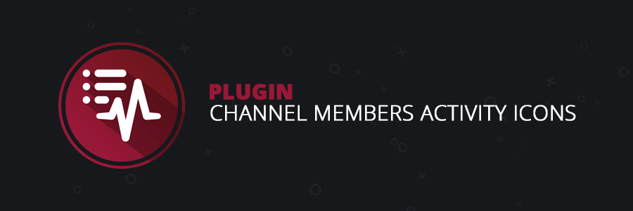

----
# Channel Members Activity Icons

### Description

Checks the users' current primary activities and adds an icon on the channel members list next to the user if there's one available.

### Preview

### Todo

Add the following settings options:

- [ ] Slider input to change icon size
- [ ] Slider input to change icon border radius
- [ ] Allow the user to blacklist certain activities (tag list)
- [ ] Allow the user to use the large asset image instead of the small asset image for certain activities (tag list)
